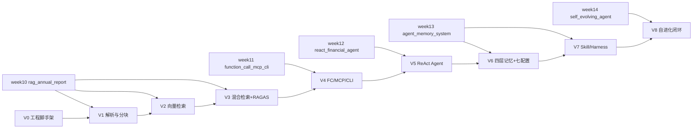
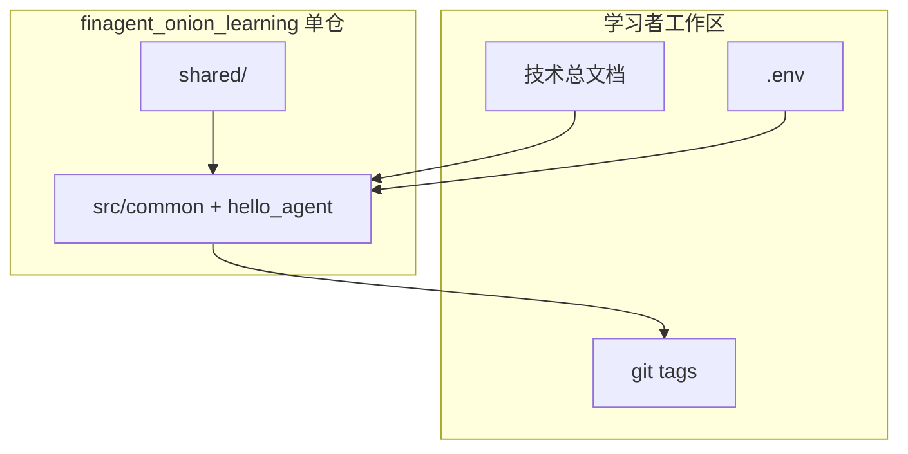
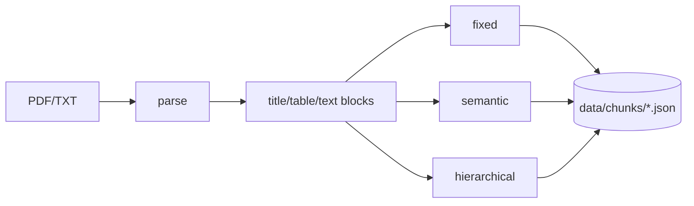
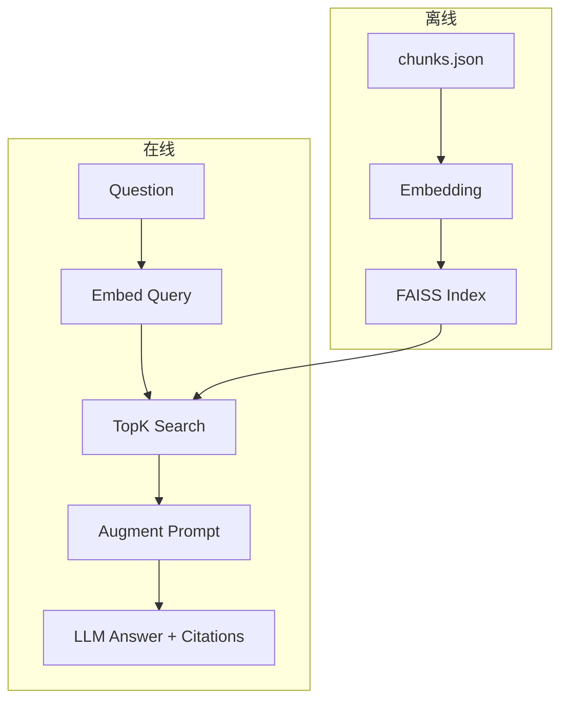
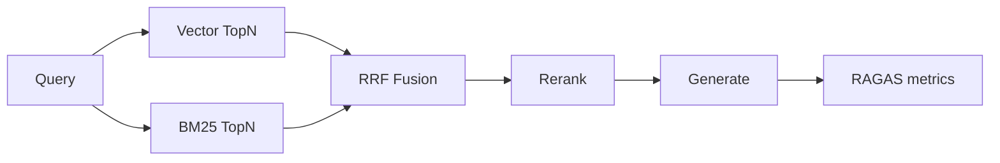
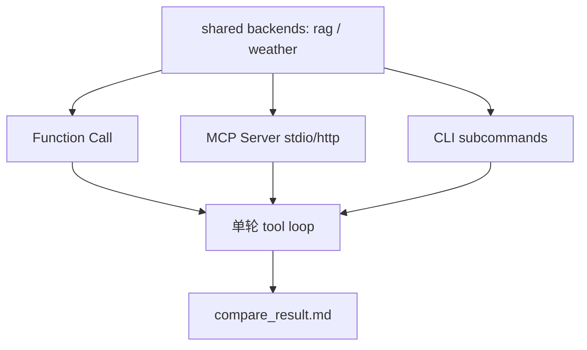
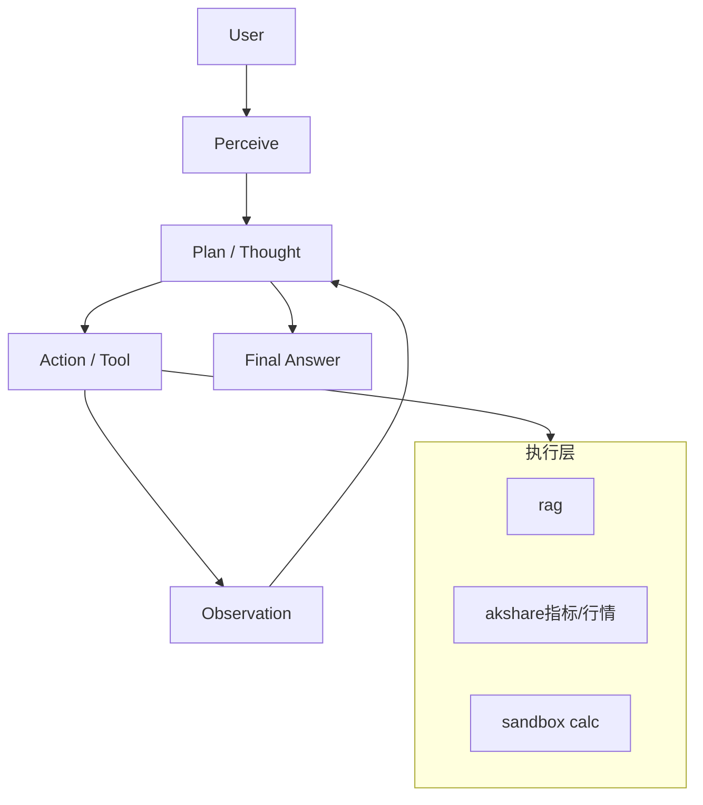
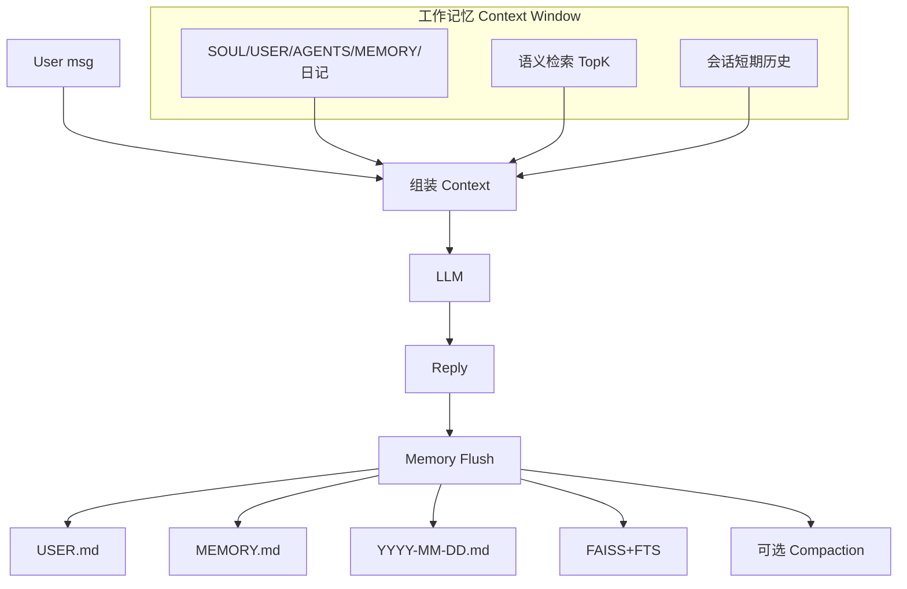
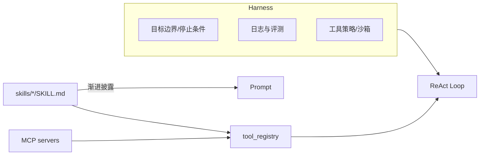
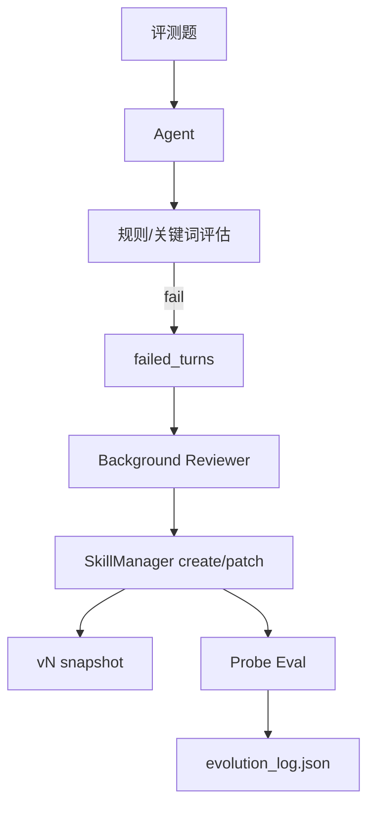

# 金融分析 Agent：0→1 洋葱式学习技术总文档

> 角色定位：深度学习学习总教练 × 技术文档架构师 × 面试官 × 代码审查员  
> 目标产品：可版本演进的 **金融分析 Agent**  
> 学习方法：洋葱式叠加（每层可独立验收，上层只加能力不推翻下层）  
> 融合资产：`week10` RAG → `week11` 工具调用 → `week12` ReAct → `week13` 记忆/Harness → `week14` 自进化  
> 文档用途：按版本执行开发与学习；**本文件是总路线图**。代码在 **同一个仓库目录** 里叠加演进，每版验收后打 tag 并推到 GitHub，用 `git diff` / Compare 看这一层改了什么。

---

## 0. 需求评估结论（先读这一节）

### 0.1 合理性评价：**方向正确，范围过大，需分层裁剪**

| 维度 | 评价 | 说明 |
|------|------|------|
| 目标场景（金融分析 Agent） | ✅ 合理 | 与现有 week10–12 高度吻合，数据与工具可复用 |
| 洋葱式叠加 | ✅ 合理 | 符合 Agent 能力扩展路径：知识→工具→规划→记忆→进化 |
| 知识点覆盖面 | ⚠️ 过宽 | 一次塞入 RAG 全链路 + MCP/CLI + 四层架构 + 七配置 + 自进化，小白易淹没 |
| 「深度学习」表述 | ⚠️ 易误解 | 本路线主战场是 **LLM 应用工程**，不是从零训练 Transformer；需先对齐预期 |
| 「每版给全量代码」 | ⚠️ 需约束 | 全量粘贴会失控；改为 **骨架代码 + 复用 week 资产 + Diff 清单** |
| 版本控制 | ✅ 必须 | 每版独立 tag / 分支，验收不过不进下一版 |

### 0.2 主要不足（已优化进本路线）

1. **缺少能力边界**：未区分「教学必做 / 了解即可 / 延后选修」。  
2. **缺少依赖与数据契约**：week11–12 依赖 week10 索引，未写成硬前置。  
3. **概念命名混用**：四层记忆 vs 七大配置文件 vs Agent 四层架构，需一张对照表。  
4. **评估滞后**：RAGAS / Agent 评测应尽早出现最小闭环，而不是全部堆到最后。  
5. **安全与成本未单列**：沙箱、API Key、token 预算必须从 V2 起就有检查项。  
6. **自进化场景不宜直接上金融实盘政策**：week14 用虚构电商更可控；金融版进化放选修或 V8 简化版。

### 0.3 优化后的总原则

1. **一条主线**：年报知识库 → 工具化 → ReAct 金融 Agent → 记忆与 Harness → Skill 热拔插 → 可控自进化。  
2. **两套资产**：`week*_study` 只读参考；`finagent_onion_learning/` 是你亲手叠加的主工程。  
3. **三道闸门**：每版必须过「跑通命令 + 测试命令 + 验收清单」才打 git tag。  
4. **四分法知识点**：必做 / 对比实验 / 面试口述 / 延后选修。  
5. **先薄后厚**：V0–V3 追求「能解释每一行」；V4+ 才引入框架感与平台感。  
6. **解耦先于堆功能**：小功能=函数，大功能=模块，领域=目录；跨领域只走契约，不互相掏实现。

### 0.4 预期对齐（非常重要）

| 你可能以为在学 | 本路线实际在学 |
|----------------|----------------|
| 反向传播、手写 CNN/Transformer 训练 | Embedding/LLM **调用**、检索与 Agent 编排 |
| 从零训练金融大模型 | 用现成模型 + RAG + 工具解决金融问答 |
| 一次做一个「最终完美系统」 | 做 9 个可演示、可回退的版本洋葱 |

> 若你同时想补「模型结构 / 分布式 / RL」，那是 week15–17 旁路，不阻塞本 Agent 主线。

---

## 1. 融合地图：现有项目 → 新版本



| 新版本 | 核心能力 | 主要复用路径 | 新增重点 |
|--------|----------|--------------|----------|
| V0 | 工程与 Git | — | 目录、环境、约定 |
| V1 | PDF/TXT 解析 + 三种分块 | `week10/.../parse_pdf.py` `chunk_documents.py` | 亲手跑通解析分块 |
| V2 | Embedding + FAISS + 生成 | `week10/.../build_index.py` `rag_pipeline.py` | 最小 RAG |
| V3 | BM25 + RRF + Rerank + RAGAS | `week10/.../evaluation/` | 检索质量与评估 |
| V4 | Function Call / MCP / CLI | `week11/function_call_mcp_cli` | 三种接入对比 |
| V5 | ReAct + 金融工具 + 沙箱计算器 | `week12/react_financial_agent` | Thought-Action 循环 |
| V6 | 四层记忆 + 七配置 + 压缩 | `week13/agent_memory_system` | 跨会话「认识你」 |
| V7 | Skill 热拔插 + 渐进披露 + stdio/http | `week13` skills + MCP | Harness / Agent 四层 |
| V8 | 评估驱动 Skill 进化 | `week14/self_evolving_agent` | Nudge / 版本快照 |

### 1.1 各版技术栈总表（开发前先看）

| 版本 | 核心技术 / 库 | 协议与算法 | 工程手段 |
|------|----------------|------------|----------|
| V0 | Python 3.10+、`venv`、`python-dotenv` | 环境变量契约 | Git 分支 / tag / GitHub Compare |
| V1 | `pathlib`、PyMuPDF、pdfplumber、`pypdf` | 固定窗 / 语义切分 / 层级 Small-to-Big | JSON 落盘、pytest |
| V2 | DashScope/OpenAI Embedding、FAISS `IndexFlatIP`、Chat Completions | 向量检索、RAG Prompt、引用 | 离线索引 + 在线问答 |
| V3 | `rank-bm25`、Rerank（API 或 CrossEncoder）、RAGAS 或 Hit@K | BM25、RRF、精排 | 消融实验、金标集 |
| V4 | OpenAI `tool_calls`、MCP SDK、`argparse`+`subprocess` | JSON Schema、stdio JSON-RPC / HTTP | 同一后端三种适配器 |
| V5 | ReAct、AkShare、FastAPI | Thought-Action-Observation、熔断 | AST 沙箱计算器、max_steps |
| V6 | SQLite、Markdown 配置、FTS5、APScheduler | 四层记忆组装、Flush、压缩 | 跨会话持久化、心跳 |
| V7 | SKILL.md（YAML frontmatter）、mtime 热加载 | 渐进式披露、工具策略 | 领域目录热拔插 |
| V8 | 规则评估、Skill 快照 | Nudge / 最小 patch、Probe Eval | 评测闸门、可回滚 |

> 上层默认 **复用下层技术**，只新增本表该行；不要为新版本换一套无关技术栈。

---

## 2. 概念对照表（防混淆）

### 2.1 Agent 四层架构（运行时职责）

| 层 | 职责 | 本路线落点 |
|----|------|------------|
| 感知层 | 接收用户输入、工具 Observation、心跳事件 | V5+ `serve` / session |
| 规划层 | ReAct / 是否调工具 / 任务分解 | V5 `agent_loop` |
| 记忆层 | 工作/短期/长期/语义记忆组装 Context | V6 |
| 执行层 | 工具、CLI、MCP、沙箱 | V4–V5、V7 |

### 2.2 四层记忆模型（存什么）

| 层 | 存什么 | 典型实现 |
|----|--------|----------|
| 工作记忆 | 当次 Prompt 拼装结果 | 内存 messages |
| 短期记忆 | 本会话历史 + 近端日记 | SQLite + `YYYY-MM-DD.md` |
| 长期记忆 | 稳定偏好与规则 | `USER.md` / `MEMORY.md` / `SOUL.md`… |
| 语义记忆 | 可检索的记忆片段 | FAISS + BM25/FTS |

### 2.3 七大配置文件（人设与治理，属长期记忆的「可编辑面」）

| 文件 | 作用 | 何时引入 |
|------|------|----------|
| `soul.md` / `SOUL.md` | 价值观、语气、边界 | V6 |
| `agents.md` / `AGENTS.md` | 行为规范、工具策略 | V6 |
| `identity.md` | Agent 身份卡（可与 SOUL 合并教学） | V6（可先合并进 SOUL，选修独立） |
| `user.md` / `USER.md` | 用户画像 | V6 |
| `heartbeat.md` / `HEARTBEAT.md` | 定时主动任务 | V6 |
| `memory.md` / `MEMORY.md` | 长期条目摘要 | V6 |
| 每日工作记忆 `YYYY-MM-DD.md` | 近端日记 | V6 |

> 优化：`identity.md` 在 week13 未单独出现时可与 `SOUL.md` 合并；V6 验收不强制七文件物理拆分，但面试要能讲清七类职责。

### 2.4 Prompt / Context / Harness

| 层次 | 一句话 |
|------|--------|
| Prompt Engineering | 怎么把话说清楚 |
| Context Engineering | 模型此刻该看到什么（RAG/工具/记忆） |
| Harness Engineering | 模型在什么约束与反馈回路里跑（停止条件、日志、评测、沙箱） |

---

## 3. 主工程目录约定（单仓叠加，用 Git 当版本切片）

**不要为每个版本开一个平行目录。** 平行目录（`v0_scaffold/`、`v1_parse_chunk/` …）看起来整齐，但对比时要在两棵树上找同名文件，洋葱「加了一层」会变成「又复制了一份」。单目录迭代 + tag 才是直观的：GitHub 上点 Compare，就是这一版真正改动的代码。

### 3.1 仓库树（会随版本变厚，V0 起步如下）

```text
finagent_onion_learning/          # = Git 仓库根，始终只有这一份代码
├── 技术总文档.md                 # 本文件（路线图，不随业务代码膨胀）
├── README.md                     # 当前版本怎么跑
├── CHANGELOG.md                  # 每版追加「本版 Diff 意图 + 关键文件」
├── tags.md                       # tag 与验收记录
├── .env.example
├── requirements.txt              # 依赖只增不拆仓
├── .gitignore
├── shared/                       # 契约与最小样例（稳定）
│   ├── contracts.md
│   └── sample_docs/
├── src/                          # 唯一业务代码根：按领域目录叠加
│   ├── common/                   # V0：配置、类型、日志（谁都可以依赖）
│   ├── ingest/                   # V1：解析 / 分块
│   ├── rag/                      # V2–V3：向量、检索、生成、融合评估
│   ├── tools/                    # V4–V5：可调用的业务后端（无协议细节）
│   ├── adapters/                 # V4：function_call / mcp / cli（只做接线）
│   ├── agent/                    # V5：ReAct 循环与 HTTP 入口
│   ├── memory_sys/               # V6：记忆读写（与仓库根 memory/*.md 分开）
│   ├── harness/                  # V7：Skill 加载与工具注册
│   └── evolve/                   # V8：评估 / Reviewer / Skill 版本
├── data/                         # V1 起：raw / parsed / chunks
├── tests/                        # 镜像 src 领域目录，如 tests/ingest/
├── vectorstore/                  # V2 起
├── evaluation/                   # V3 起：金标与结果，不含业务实现
├── memory/                       # V6 起：七配置 Markdown（数据，不是 Python）
└── skills/                       # V7 起：每个 Skill 一个子目录
```

> 后面各版「文件树」表示 **本版结束后相对上一 tag 的增量**，不是另开工程。V0 起步可以只有 `src/common/` + 入口脚本；领域目录随版本出现，不要预先建空壳去「占位」。

### 3.2 Git / GitHub 工作流（强制）

```text
feat/vN-xxx  开发  →  验收清单全勾  →  合入 main  →  tag vN.0  →  push --tags
```

1. 一个版本一条功能分支，避免半成品污染 `main`。  
2. **验收通过才 tag**；tag 是只读切片，不要改已发布 tag。  
3. 每版至少一次有意义的 commit（建议按「一个能力一个 commit」）。  
4. **禁止**提交 `.env`、真实 Key、大模型权重、完整年报 PDF（`.gitignore` + 样例数据）。

**本版开发：**

```powershell
cd e:\study\AI_develop\00_python_preview\1_3\code\finagent_onion_learning
git checkout main
git checkout -b feat/v1-parse-chunk
# ... 在 src/ tests/ data/ 里改代码并自测 ...
git add -A
git commit -m "feat(v1): add doc parse and three chunking strategies"
git push -u origin feat/v1-parse-chunk
```

**验收后打 tag 并推 GitHub：**

```powershell
git checkout main
git merge --no-ff feat/v1-parse-chunk
git tag -a v1.0 -m "v1: parse + three chunking strategies"
git push origin main --tags
```

**直观看「这一版改了哪些代码」（核心）：**

```powershell
git diff v0.0..v1.0 --stat          # 改了哪些文件、增减行数
git diff v0.0..v1.0                 # 完整 diff
git log v0.0..v1.0 --oneline        # 这一版有哪些提交
```

GitHub 网页（把 `USER/REPO` 换成你的仓库）：

```text
https://github.com/USER/REPO/compare/v0.0...v1.0
```

回退到某一已验收版本做对照实验：

```powershell
git switch --detach v2.0            # 只读查看 V2 当时的代码
git switch main                     # 回到最新
```

**CHANGELOG 写法（每版合并前追加一节）：**

```markdown
## v1.0 — 解析与分块
- 相对 tag：`v0.0..v1.0`
- 意图：把样例文档变成三种策略的 chunk JSON
- 关键文件：`src/ingest/parse_docs.py` `src/ingest/chunking.py` `tests/ingest/test_chunking.py`
```

### 3.3 开发规范（全程强制：解耦 · 鲁棒 · 粒度 · 命名）

粒度口诀：**小功能是函数，大功能是一个 `.py`，每个领域是一个目录。**

#### 粒度

| 单位 | 放什么 | 例子 | 反例 |
|------|--------|------|------|
| 函数 | 一件可测的小事，无副作用或副作用明确 | `chunk_fixed()`、`rrf_fuse()`、`safe_eval()` | 一个函数里解析 PDF 又调 LLM |
| 模块（`.py`） | 一个大功能 / 一种策略族 | `chunking.py`、`retriever.py`、`skill_loader.py` | `utils.py` 大杂烩、`agent.py` 两千行包打天下 |
| 目录 | 一个领域，对外只暴露窄接口 | `src/rag/`、`src/adapters/mcp/` | 所有 py 平铺在 `src/` |

建议：单文件超过 **300 行** 或出现第二套职责，就拆文件；单函数超过 **80 行** 就拆步骤函数。

#### 解耦（允许的依赖方向）

```text
common  ←  所有领域可以依赖
ingest  ←  只被「读 data/ 的离线脚本」使用，运行时 Agent 不 import 解析器
rag     ←  agent / tools 可以调检索接口，禁止反过来 import ReAct
tools   ←  纯业务（查年报、行情）；禁止包含 MCP/CLI/Prompt
adapters←  只把 tools 接到 FC / MCP / CLI；禁止写检索算法
agent   ←  编排 rag + tools +（V6+）memory
memory_sys / harness / evolve  ←  只向下依赖，不改下层算法文件「顺便修检索」
```

规则：

1. **领域之间只传契约对象**（`Chunk`、`ToolResult`），不传对方模块的私有类。  
2. **同一业务后端只实现一次**（如 `rag_search`），三种调用方式只做适配。  
3. **配置与密钥只进 `src/common/config.py`**，业务函数禁止 `os.getenv` 散落。  
4. **不要循环 import**；需要互相通知时用参数 / 回调 / 事件，而不是互掏。

#### 鲁棒

| 点 | 做法 |
|----|------|
| 返回值 | 对外 I/O、工具、LLM 调用统一 `ToolResult: {ok, data, error}`，禁止把异常直接甩给模型 |
| 捕获 | 禁止裸 `except:`；捕获具体异常并写入 `error`，同时打日志 |
| 超时 | HTTP / LLM / 子进程必须有 timeout |
| 循环 | ReAct / 工具环必须有 `max_steps`、重复 Action 熔断 |
| 输入 | 路径、表达式、股票代码先校验再执行 |
| 沙箱 | 计算器用 AST 白名单；CLI 命令白名单；禁止无约束 `shell=True` |
| 空结果 | 检索为空时明确「无依据」，禁止用模型参数知识填空 |
| 日志 | 关键步骤记录 `request_id` / 工具名 / 耗时，便于对照 GitHub 版本排错 |

#### 命名规范

| 对象 | 规则 | 正例 | 反例 |
|------|------|------|------|
| 目录 | 小写 + 下划线，领域名词 | `ingest/` `memory_sys/` | `RAGCode/` `newnew/` |
| 模块文件 | 小写 + 下划线，动词或职责名词 | `chunking.py` `retriever.py` | `do.py` `misc.py` |
| 函数 | 动词开头 snake_case | `parse_pdf` `fuse_rrf` `load_user_md` | `pdf` `RRF` `handle` |
| 类 | PascalCase | `Chunk` `HybridRetriever` | `chunk_cls` |
| 常量 | 全大写下划线 | `MAX_STEPS` `EMBEDDING_DIM` | `maxSteps` |
| 私有 | 单前缀下划线 | `_eval_ast` `_THOUGHT_RE` | 公开一堆内部细节 |
| 测试 | `test_<被测函数或模块>.py`，目录镜像 `src` | `tests/rag/test_rrf.py` | `tests/test1.py` |
| Git | `feat(vN):` / `fix(vN):` / `chore(vN):` | `feat(v3): add rrf fusion` | `update` `改了一点` |

Markdown 配置文件沿用 week13 大写（`SOUL.md`），与 Python 模块名空间隔离，不要写成 `soul.py`。

更细的条款见仓库 `shared/CONVENTIONS.md`，审查时以该文件为准。

---

## 4. 环境与前置（全局）

### 4.1 建议环境

- Python 3.10+  
- Windows / PowerShell（你当前环境）  
- 可选：本地 `bge-small-zh`（week12 已有）或 DashScope Embedding API  

### 4.2 全局运行前检查

```powershell
cd e:\study\AI_develop\00_python_preview\1_3\code\finagent_onion_learning
python -V
Copy-Item .env.example .env   # 首次
# 编辑 .env：DASHSCOPE_API_KEY=...（或你使用的兼容 OpenAI 接口）
$env:PYTHONPATH = (Resolve-Path .).Path   # 保证 from src.xxx 可导入
```

### 4.3 数据策略（优化后）

| 阶段 | 数据 | 原因 |
|------|------|------|
| V0–V2 | `shared/sample_docs` 1 份 TXT + 1 份小 PDF | 快、可解释、不卡下载 |
| V3+ | 可选挂载 `week10/.../data2` 年报索引 | 体验真实金融问答 |
| V4–V5 | 复用 week10 FAISS（若已构建） | 避免重复烧 Embedding 费用 |
| V8 | 虚构政策/Skill（参考 week14） | 进化空间大、评测可控 |

---

# 版本说明书

以下每一版均包含你要求的固定栏目。  
**代码策略**：给出「本版结束后的仓库树 + 关键骨架/接口」；完整实现优先从对应 week 项目 **按领域目录拷进 `src/<domain>/` 后删繁就简并叠加**。对照用 `git diff v{N-1}.0..vN.0`。每版开发遵守 §3.3。

每版固定多一栏：**本版技术栈**（库 / 算法 / 本版必须遵守的解耦点）。

---

## V0 — 工程脚手架与学习契约

### 版本目标与前置条件

- **目标**：固定目录、依赖、环境变量、Git、文档模板；能 `python -c "print('ok')"`。  
- **前置**：会用 PowerShell、会装 Python 包、有可用 LLM API Key（或先空跑本地逻辑）。

### 本版技术栈

| 类别 | 选用 |
|------|------|
| 语言 / 环境 | Python 3.10+、`venv`、`pip` |
| 配置 | `python-dotenv`、`.env` / `.env.example` |
| 版本 | Git、annotated tag、GitHub Compare |
| 本版解耦 | 密钥与路径只放 `src/common/config.py`；入口脚本不写业务 |

### 架构图



### 文件树（V0 结束时）

```text
finagent_onion_learning/
├── README.md
├── CHANGELOG.md
├── tags.md
├── .env.example
├── requirements.txt
├── .gitignore
├── shared/CONVENTIONS.md
├── shared/contracts.md
├── shared/sample_docs/demo.txt
└── src/
    ├── hello_agent.py           # 入口：只 print 就绪
    └── common/
        ├── __init__.py
        ├── config.py            # load_dotenv、校验 Key、项目根路径
        └── types.py             # Chunk / ToolResult 类型（先定义后实现）
```

### 按文件路径给出的代码

**`.gitignore`**

```gitignore
.env
__pycache__/
*.pyc
.venv/
vectorstore/*.index
vectorstore/*.faiss
models/
*.pdf
!shared/sample_docs/**
.DS_Store
```

**`.env.example`**

```env
DASHSCOPE_API_KEY=sk-xxx
OPENAI_BASE_URL=https://dashscope.aliyuncs.com/compatible-mode/v1
OPENAI_MODEL=qwen-plus
EMBEDDING_MODEL=text-embedding-v3
```

**`src/common/config.py`**

```python
import os
import sys

# `python src/common/config.py` 会把本目录插到 sys.path[0]，
# 导致本地 types.py 遮蔽标准库 types（GenericAlias 循环导入）。
_this_dir = os.path.abspath(os.path.dirname(__file__))
if sys.path and os.path.normcase(os.path.abspath(sys.path[0])) == os.path.normcase(
    _this_dir
):
    sys.path.pop(0)

from pathlib import Path

try:
    from dotenv import load_dotenv
    load_dotenv(Path(__file__).resolve().parents[2] / ".env")
except ImportError:
    pass

ROOT = Path(__file__).resolve().parents[2]

def missing_required_keys() -> list[str]:
    required = ["DASHSCOPE_API_KEY"]
    return [k for k in required if not os.getenv(k)]

if __name__ == "__main__":
    missing = missing_required_keys()
    print("OK" if not missing else f"MISSING: {missing}")
```

**`src/common/types.py`（契约先于实现）**

```python
from typing import Any, TypedDict

class ToolResult(TypedDict):
    ok: bool
    data: Any
    error: str | None
```

**`src/hello_agent.py`**

```python
print("FinAgent Onion Learning — V0 ready")
```

**`requirements.txt`（起步）**

```text
python-dotenv>=1.0.0
openai>=1.40.0
numpy>=1.26.0
faiss-cpu>=1.8.0
rank-bm25>=0.2.2
pypdf>=4.0.0
pymupdf>=1.24.0
pdfplumber>=0.11.0
fastapi>=0.110.0
uvicorn>=0.27.0
httpx>=0.27.0
pytest>=8.0.0
```

**`shared/contracts.md`（摘要）**

- Chunk 字段：`chunk_id, text, source, page_num, section_path, strategy`  
- Tool 返回：`{"ok": bool, "data": ..., "error": str|null}`  
- 只有一套 `src/`：新版本在旧模块上加文件/加函数，不平行复制一份工程。

### 运行命令

```powershell
cd e:\study\AI_develop\00_python_preview\1_3\code\finagent_onion_learning
python -m venv .venv
.\.venv\Scripts\Activate.ps1
pip install -r requirements.txt
$env:PYTHONPATH = (Resolve-Path .).Path
python src\hello_agent.py
python src\common\config.py
```

### 测试命令

```powershell
python -c "from pathlib import Path; assert Path('shared/sample_docs/demo.txt').exists()"
```

### 验收清单

- [ ] 虚拟环境可激活  
- [ ] `src/hello_agent.py` 输出就绪信息  
- [ ] `src/common/config.py` 能报告 Key 是否缺失  
- [ ] `.env` 已配置且不被 git 跟踪  
- [ ] 已 `git init`（若尚未）、首次提交，并打 tag `v0.0`（可先只本地，有远端再 `git push origin main --tags`）  

### 知识点讲解

- **为什么要脚手架**：Agent 项目失败常死在路径混乱、密钥泄漏、不可复现。  
- **契约优于框架**：先约定 Chunk/Tool 返回结构，后面 RAG/MCP/Skill 才能热拔插。  
- **粒度**：小功能函数、大功能模块、领域目录；细则见 `shared/CONVENTIONS.md`。

### 面试题

1. 为什么 API Key 不能提交到 Git？泄漏后应如何处置？  
2. 什么是「可复现」？环境、数据、模型版本各扮演什么角色？  
3. 教学项目里「样例数据」和「全量年报」如何取舍？

### Git 提交建议

```text
chore(v0): scaffold single-repo onion workspace

git tag -a v0.0 -m "v0: scaffold"
git push origin main --tags   # 有 GitHub 远端时
```

### 下一版钩子

→ **V1**：把 `demo.txt` / 小 PDF 解析成带元数据的块，并对比三种分块策略产出 JSON。

---

## V1 — PDF/TXT 解析 + 三种分块

### 版本目标与前置条件

- **目标**：实现 Loader → 结构化块 → fixed / semantic / hierarchical 三种分块，落盘 JSON。  
- **前置**：V0 验收通过；可读懂 `week10_study/rag_annual_report/src/parse_pdf.py` 与 `chunk_documents.py`。

### 本版技术栈

| 类别 | 选用 |
|------|------|
| TXT | `pathlib` + UTF-8 文本 |
| PDF 文字 / 标题 | PyMuPDF（`fitz`）字体大小/加粗识别章节 |
| PDF 表格 | pdfplumber → Markdown 表 |
| 可选 OCR | pytesseract（扫描页，选修） |
| 分块算法 | 固定窗+overlap；语义（遇 title/table 切）；层级父子块 |
| 本版解耦 | `parse_*` 只产出 block 列表；`chunk_*` 只吃 block；落盘脚本不写算法 |

### 架构图



### 文件树（相对 v0.0 的增量，验收后 tag `v1.0`）

```text
src/ingest/
├── parse_txt.py            # 函数 parse_txt(path) -> list[block]
├── parse_pdf.py            # 函数 parse_pdf(path) -> list[block]
├── parse_docs.py           # 函数 parse_file(path) 按后缀分发
├── chunking.py             # 函数 chunk_fixed / chunk_semantic / chunk_hierarchical
└── run_chunk.py            # 入口：读 data/raw，写 data/chunks
data/raw/  data/parsed/  data/chunks/
tests/ingest/test_chunking.py
```

对照：`git diff v0.0..v1.0 --stat`

### 按文件路径给出的代码（骨架）

**`src/ingest/chunking.py`**

```python
from __future__ import annotations
from dataclasses import dataclass, asdict
from typing import Literal

Strategy = Literal["fixed", "semantic", "hierarchical"]

@dataclass
class Chunk:
    chunk_id: str
    text: str
    source: str
    page_num: int | None = None
    section_path: str = ""
    strategy: Strategy = "fixed"
    parent_id: str | None = None  # hierarchical only

def chunk_fixed(blocks: list[dict], size: int = 500, overlap: int = 50) -> list[Chunk]:
    # 拼接 text，按字符窗滑动；表格块尽量整块保留
    ...

def chunk_semantic(blocks: list[dict], max_chars: int = 800) -> list[Chunk]:
    # title 强制切分；table 独立；text 累积到阈值
    ...

def chunk_hierarchical(blocks: list[dict]) -> list[Chunk]:
    # 父块=章节，子块=细粒度；子块带 parent_id
    ...

STRATEGIES = {
    "fixed": chunk_fixed,
    "semantic": chunk_semantic,
    "hierarchical": chunk_hierarchical,
}
```

**`src/ingest/run_chunk.py`**

```python
import json
from pathlib import Path
from src.ingest.parse_docs import parse_file
from src.ingest.chunking import STRATEGIES
from src.common.config import ROOT

raw = ROOT / "data" / "raw"
out = ROOT / "data" / "chunks"
out.mkdir(parents=True, exist_ok=True)

for path in list(raw.glob("*.txt")) + list(raw.glob("*.pdf")):
    blocks = parse_file(path)
    for name, fn in STRATEGIES.items():
        chunks = [c.__dict__ if hasattr(c, "__dict__") else c for c in fn(blocks)]
        (out / f"{path.stem}_{name}.json").write_text(
            json.dumps(chunks, ensure_ascii=False, indent=2), encoding="utf-8"
        )
print("done")
```

> 落地时：优先对照复制 week10 的解析/分块逻辑，删掉下载与 OCR 可选路径，保留核心三种策略。

### 运行命令

```powershell
# 在仓库根目录
New-Item -ItemType Directory -Force data\raw | Out-Null
Copy-Item .\shared\sample_docs\* .\data\raw\ -Force
python src\ingest\run_chunk.py
```

### 测试命令

```powershell
pytest tests\ingest\test_chunking.py -q
# 手工：对比同一文档三种策略的 chunk 数量与边界
python -c "import json,glob; [print(p,len(json.load(open(p,encoding='utf-8')))) for p in glob.glob('data/chunks/*.json')]"
```

### 验收清单

- [ ] TXT 与 PDF 均可解析出块  
- [ ] 三种策略都有输出 JSON  
- [ ] Chunk 含 `source/page/section/strategy`  
- [ ] 能口述：fixed 易截断句子；semantic 保章节；hierarchical 服务 Small-to-Big  
- [ ] `parse_*` 与 `chunk_*` 可单独单测，互不 import LLM  

### 知识点讲解

- **为何分块**：Embedding 有长度限制；检索要细粒度；Prompt 有 token 成本。  
- **Overlap**：防止跨句关键信息落在切点两侧。  
- **表格**：尽量 Markdown 整表一块，避免行列被切开。

### 面试题

1. chunk_size 过大/过小分别导致什么问题？  
2. 语义分块与递归字符分块区别？年报场景为何重视标题？  
3. hierarchical 检索时「子块命中、父块送入 LLM」解决什么矛盾？

### Git 提交建议

```text
feat(v1): add doc parse and three chunking strategies
# 验收后：git tag -a v1.0 -m "v1: parse + chunk" && git push origin main --tags
# 对照：git diff v0.0..v1.0 --stat
```

### 下一版钩子

→ **V2**：选一种默认策略（建议 semantic）做 Embedding + FAISS + 最小问答生成。

---

## V2 — 最小 RAG（向量化 / 检索 / 生成）

### 版本目标与前置条件

- **目标**：离线建索引 + 在线「问题→TopK→Prompt→答案+引用」。  
- **前置**：V1 有 chunks；API Key 可用（或本地 embedding）。

### 本版技术栈

| 类别 | 选用 |
|------|------|
| Embedding | DashScope `text-embedding-v3`（或本地 BGE） |
| 向量库 | FAISS `IndexFlatIP` + 元数据 JSON |
| 生成 | OpenAI 兼容 Chat Completions（如 `qwen-plus`） |
| Prompt | 仅依据摘录作答 + 来源引用 |
| 本版解耦 | embed / index / retrieve / generate 四个模块；`ask.py` 只编排 |

### 架构图



### 文件树（相对 v1.0 增量，tag `v2.0`）

```text
src/rag/
├── embedder.py          # embed_texts / embed_query
├── indexer.py           # build_index / save / load
├── retriever.py         # search(query, k) -> hits
├── generator.py         # answer(question, hits) -> text, cites
└── ask.py               # 编排入口，禁止把 FAISS 细节写在这里
vectorstore/
tests/rag/test_retriever.py
```

对照：`git diff v1.0..v2.0 --stat`

### 按文件路径给出的代码（骨架）

**`src/rag/ask.py`**

```python
from src.rag.retriever import search
from src.rag.generator import answer

def ask(question: str, k: int = 5) -> dict:
    hits = search(question, k=k)
    text, cites = answer(question, hits)
    return {"answer": text, "citations": cites, "hits": hits}

if __name__ == "__main__":
    import sys
    q = sys.argv[1] if len(sys.argv) > 1 else "这份文档的主题是什么？"
    print(ask(q))
```

**`src/rag/generator.py`（提示词要点）**

```text
你是金融文档助手。仅依据给定摘录回答；不知则说不知。
每条结论后标注来源 [source:p.page]。
```

> 完整实现参考：`week10_study/rag_annual_report/src/build_index.py`、`rag_pipeline.py`（先关掉 BM25/Rerank，只留向量通路）。

### 运行命令

```powershell
python src\rag\indexer.py
python src\rag\ask.py "毛利率相关表述有哪些？"
```

### 测试命令

```powershell
pytest tests\rag\test_retriever.py -q
python src\rag\ask.py "不存在的公司XYZ的营收"   # 应表现为拒答/低置信，而非瞎编
```

### 验收清单

- [ ] 索引文件生成且可加载  
- [ ] 相关问题能返回带引用答案  
- [ ] 无关问题不会假装有依据  
- [ ] 能画离线/在线双流水线  

### 知识点讲解

- **RAG = Index + Retrieve + Generate**  
- **Embedding 空间**：语义近 → 向量近；检索常用余弦/内积。  
- **引用**：工程可信度核心，面试高频。

### 面试题

1. RAG 与 Fine-tuning 如何选型？能否组合？  
2. 为什么「检索到了」仍可能答错？（上下文噪声、排序、幻觉）  
3. FAISS FlatIP 与 HNSW 的权衡？

### Git 提交建议

```text
feat(v2): minimal vector RAG with citations
# 验收后：git tag -a v2.0 -m "v2: min rag" && git push origin main --tags
# 对照：git diff v1.0..v2.0 --stat
```

### 下一版钩子

→ **V3**：加 BM25、RRF 融合、Rerank，并用 RAGAS 做最小评估表。

---

## V3 — 混合检索 + RRF + Rerank + RAGAS

### 版本目标与前置条件

- **目标**：向量 + BM25 → RRF →（可选）Rerank → 生成；输出评估指标。  
- **前置**：V2 可问答；理解 week10 `evaluation/`。

### 本版技术栈

| 类别 | 选用 |
|------|------|
| 稀疏检索 | `rank-bm25`（BM25Okapi） |
| 融合 | Reciprocal Rank Fusion（`k=60` 常用） |
| 精排 | DashScope rerank 或本地 CrossEncoder（放在融合之后） |
| 评估 | RAGAS 四指标；小白可先 Hit@K + 人工表 |
| 本版解耦 | `rrf_fuse` 纯函数无 I/O；retriever 与 evaluator 分开；金标只放 `evaluation/` |

### 架构图



### 文件树（相对 v2.0 增量，tag `v3.0`）

```text
src/rag/
├── bm25_index.py           # 构建/查询 BM25
├── rrf.py                  # 纯函数 rrf_fuse
├── reranker.py             # rerank(query, hits)
├── hybrid_retriever.py     # 向量 + BM25 → RRF → 可选 rerank
└── evaluate_ragas.py       # 读 evaluation/gold_qa.json，写 results/
evaluation/
├── gold_qa.json
└── results/
tests/rag/test_rrf.py
```

对照：`git diff v2.0..v3.0 --stat`

### 按文件路径给出的代码（关键）

**`src/rag/rrf.py`**

```python
def rrf_fuse(rank_lists: list[list[str]], k: int = 60) -> list[tuple[str, float]]:
    scores: dict[str, float] = {}
    for ranks in rank_lists:
        for i, doc_id in enumerate(ranks):
            scores[doc_id] = scores.get(doc_id, 0.0) + 1.0 / (k + i + 1)
    return sorted(scores.items(), key=lambda x: x[1], reverse=True)
```

**评估最小集 `gold_qa.json` 字段**

```json
[
  {
    "question": "……",
    "ground_truth": "……",
    "must_cite_source_substring": "茅台"
  }
]
```

指标建议（小白可先做简化版）：

| 指标 | 含义 | 小白替代 |
|------|------|----------|
| Faithfulness | 答案是否忠于上下文 | LLM-as-judge 或关键词约束 |
| Answer Relevancy | 是否答到点上 | 人工 1–5 分 |
| Context Precision/Recall | 检索质量 | Hit@K / 是否命中必须段落 |

> 完整 RAGAS 可参考 `week10_study/rag_annual_report/evaluation/evaluate.py`；若依赖重，先做 Hit@K + 人工表。

### 运行命令

```powershell
python src\rag\ask.py --mode hybrid --q "贵州茅台2023年营业收入？"
python src\rag\evaluate_ragas.py
```

### 测试命令

```powershell
pytest tests\rag\test_rrf.py -q
python src\rag\evaluate_ragas.py --ablation vector_only,hybrid,hybrid_rerank
```

### 验收清单

- [ ] 同一问题可切换 vector_only / hybrid / hybrid+rerank  
- [ ] RRF 单测覆盖「两路排名融合」  
- [ ] 至少一份 `results/*.json` 评估产物  
- [ ] 能解释：关键词问题 BM25 更强，释义问题向量更强  

### 知识点讲解

- **BM25**：词频与文档长度归一的经典稀疏检索。  
- **RRF**：不依赖分数量纲，只靠排名融合，工程极常用。  
- **Rerank**：交叉编码器精排，贵但准；放在融合之后控成本。

### 面试题

1. 为什么不能直接把向量分与 BM25 分相加？  
2. Rerank 放在召回前还是后？为什么？  
3. RAGAS 四指标分别盯检索还是生成？

### Git 提交建议

```text
feat(v3): hybrid retrieval with RRF rerank and eval harness
# 验收后：git tag -a v3.0 -m "v3: hybrid + ragas" && git push origin main --tags
# 对照：git diff v2.0..v3.0 --stat
```

### 下一版钩子

→ **V4**：把 `rag_search` 封装成可被 Function Call / MCP / CLI 三种方式调用的工具。

---

## V4 — 工具调用：Function Call × MCP × CLI

### 版本目标与前置条件

- **目标**：同一业务后端（RAG + 可选天气）用三种方式接入，产出对比表。  
- **前置**：V3 检索可用，或直接挂载 week10 索引；读完 week11 ARCHITECTURE。

### 本版技术栈

| 类别 | 选用 |
|------|------|
| Function Call | OpenAI 兼容 `tools` + `tool_calls` + JSON Schema |
| MCP | MCP Python SDK；stdio JSON-RPC（本地）/ HTTP+SSE（远程） |
| CLI | `argparse` 子命令；Agent 侧 `subprocess` 调白名单命令 |
| 本版解耦 | `src/tools/` 纯业务；`src/adapters/{function_call,mcp,cli}/` 只接线 |

### 架构图



### 文件树（相对 v3.0 增量，tag `v4.0`）

```text
src/tools/
├── rag_backend.py              # rag_search() -> ToolResult
└── weather_backend.py          # query_weather() -> ToolResult
src/adapters/
├── function_call/run_fc.py
├── mcp/servers/rag_server.py
├── mcp/run_mcp_host.py
└── cli/main.py + run_cli_agent.py
compare.py                      # 仓库根：同一问题 × 三方式
output/compare_result.md
```

对照：`git diff v3.0..v4.0 --stat`

### 按文件路径给出的代码（要点）

**统一后端返回契约**

```python
def rag_search(query: str, top_k: int = 5) -> dict:
    try:
        hits = ...
        return {"ok": True, "data": hits, "error": None}
    except Exception as e:
        return {"ok": False, "data": None, "error": str(e)}
```

**三者差异（必背）**

| 方式 | 工具从哪来 | 怎么执行 |
|------|------------|----------|
| Function Call | 手写 JSON Schema | 进程内 dispatch |
| MCP | Server 自动 list_tools | 跨进程 call_tool |
| CLI | argparse 子命令 | subprocess，stdout 回传 |

> 直接融合：把 week11 三种封装 **按适配器目录拷进 `src/adapters/`**，后端只放 `src/tools/`，禁止在 MCP 文件里重写检索算法。

### 运行命令

```powershell
python src\adapters\function_call\run_fc.py "茅台2023营收"
python src\adapters\cli\run_cli_agent.py "北京天气"
python compare.py
```

### 测试命令

```powershell
python -c "from src.tools.rag_backend import rag_search; assert rag_search('测试')['ok'] in (True, False)"
# MCP：手动 list_tools 非空
```

### 验收清单

- [ ] 三种模式都能完成至少 1 次工具调用闭环  
- [ ] `compare_result.md` 有同一问题对比  
- [ ] 理解 MCP Host/Client/Server  
- [ ] CLI 有白名单；禁止任意 `shell=True` 无沙箱  

### 知识点讲解

- **FC 是意图层，MCP 是总线，CLI 是执行形态** —— 不互斥。  
- **热拔插**：MCP/Skill 动态发现工具，免改宿主硬编码。  
- **stdio vs HTTP**：本地子进程用 stdio；远程/多客户端用 HTTP/SSE。

### 面试题

1. 为什么说「MCP 像 USB」？它解决 FC 的什么痛点？  
2. 工具 description 写差会导致什么？  
3. 开放 bash 工具的最大风险与缓解？

### Git 提交建议

```text
feat(v4): compare function-call mcp and cli tool wiring
# 验收后：git tag -a v4.0 -m "v4: fc/mcp/cli" && git push origin main --tags
# 对照：git diff v3.0..v4.0 --stat
```

### 下一版钩子

→ **V5**：把单轮工具闭环升级为多步 ReAct，接入金融指标/股价/计算器。

---

## V5 — ReAct 金融分析 Agent

### 版本目标与前置条件

- **目标**：Thought → Action → Observation 循环；工具含 company_lookup / rag_search / financial_indicator / stock_price / calculator（沙箱）。  
- **前置**：V4；可读 `week12` 的 manual vs FC 两实现。

### 本版技术栈

| 类别 | 选用 |
|------|------|
| 规划循环 | ReAct；手写 Prompt 解析 vs 原生 Function Calling（对照） |
| 行情 / 指标 | AkShare（`stock_financial_abstract` / `stock_zh_a_hist`） |
| 计算 | `ast` 白名单沙箱，禁止 `eval` 裸奔 |
| 服务 | FastAPI + 可选 SSE |
| 鲁棒 | `MAX_STEPS`、重复 Action 熔断、工具统一 ToolResult |
| 本版解耦 | `src/tools/` 一个工具一个函数（可拆文件）；`src/agent/` 只编排 |

### 架构图



### 文件树（相对 v4.0 增量，tag `v5.0`）

```text
src/tools/
├── company_lookup.py
├── financial_indicator.py
├── stock_price.py
└── calculator.py            # AST 沙箱，单独文件便于测安全
src/agent/
├── react_manual.py
├── react_fc.py
├── loop.py                  # 统一入口，勿写成上帝文件
├── serve.py
└── evaluate.py
static/index.html
tests/tools/test_calculator_sandbox.py
```

对照：`git diff v4.0..v5.0 --stat`

### 按文件路径给出的代码（沙箱计算器示例）

**`src/tools/calculator.py`（片段）**

```python
import ast
import operator as op

_OPS = {
    ast.Add: op.add, ast.Sub: op.sub, ast.Mult: op.mul,
    ast.Div: op.truediv, ast.Pow: op.pow, ast.USub: op.neg,
}

def _eval(node):
    if isinstance(node, ast.Constant) and isinstance(node.value, (int, float)):
        return node.value
    if isinstance(node, ast.BinOp):
        return _OPS[type(node.op)](_eval(node.left), _eval(node.right))
    if isinstance(node, ast.UnaryOp):
        return _OPS[type(node.op)](_eval(node.operand))
    raise ValueError("unsupported")

def calculator(expr: str) -> dict:
    try:
        return {"ok": True, "data": _eval(ast.parse(expr, mode="eval").body), "error": None}
    except Exception as e:
        return {"ok": False, "data": None, "error": str(e)}
```

**停止条件（必做）**

- `max_steps = 8~10`  
- 连续相同 Action 熔断  
- Final Answer 退出  

### 运行命令

```powershell
python src\agent\loop.py --mode fc --q "对比茅台与五粮液近三年毛利率，并计算差值"
uvicorn src.agent.serve:app --reload --port 8012
```

### 测试命令

```powershell
pytest tests\tools\test_calculator_sandbox.py -q
python src\agent\evaluate.py   # manual vs fc 对比
```

### 验收清单

- [ ] 同一复杂问题出现多步工具轨迹  
- [ ] calculator 拒绝 `__import__` / 属性访问  
- [ ] 公司名先 lookup 再查行情  
- [ ] 能对比 manual prompt 解析 vs FC 的稳定性  

### 知识点讲解

- **ReAct**：推理与行动交织，用 Observation 纠偏。  
- **Agent 四层**：本版起明确感知/规划/记忆(暂弱)/执行。  
- **工具张力**：RAG 定性丰富 vs 结构化指标更准 —— 规划层价值所在。

### 面试题

1. ReAct 与 Plan-and-Execute 差别？  
2. 为何金融 Agent 仍需要计算器工具？  
3. max_iterations 太大/太小的后果？

### Git 提交建议

```text
feat(v5): react financial agent with sandboxed tools
# 验收后：git tag -a v5.0 -m "v5: react agent" && git push origin main --tags
# 对照：git diff v4.0..v5.0 --stat
```

### 下一版钩子

→ **V6**：会话不再「失忆」——引入四层记忆与配置文件组装 System Prompt。

---

## V6 — 四层记忆 + 七配置 + 压缩

### 版本目标与前置条件

- **目标**：跨会话记住用户偏好；Memory Flush；可选 HEARTBEAT；条目过多可压缩。  
- **前置**：V5；精读 `week13` ARCHITECTURE 与 memory 目录。

### 本版技术栈

| 类别 | 选用 |
|------|------|
| 会话短期记忆 | SQLite（消息表） |
| 长期 / 人设 | Markdown：SOUL / AGENTS / IDENTITY / USER / HEARTBEAT / MEMORY / 日记 |
| 语义记忆 | FAISS + SQLite FTS5（向量 + BM25 混合） |
| 调度 | APScheduler 解析 `HEARTBEAT.md` |
| 压缩 | 条目超阈值后 LLM 合并并重建索引 |
| 本版解耦 | `memory/` 只放 md；Python 在 `src/memory_sys/`；`serve.py` 只调用 loader，不内嵌 Flush 算法 |

### 架构图



### 文件树（相对 v5.0 增量，tag `v6.0`）

```text
memory/                         # 数据：七类 Markdown
├── SOUL.md  AGENTS.md  IDENTITY.md  USER.md
├── HEARTBEAT.md  MEMORY.md  YYYY-MM-DD.md
src/memory_sys/
├── loader.py                   # 组装 base prompt
├── session_db.py
├── retrieval.py                # 记忆混合检索
├── flush.py
└── scheduler.py
src/agent/serve.py              # 修改：组装记忆后再调 LLM
tests/memory_sys/test_loader.py
```

对照：`git diff v5.0..v6.0 --stat`

### 按文件路径给出的代码（组装顺序建议）

```text
1) SOUL / IDENTITY（人设）
2) AGENTS（行为与安全）
3) USER（用户画像）
4) 近端日记（今+昨）
5) MEMORY 近 N 条
6) 语义记忆检索 TopK
7) 会话 messages
8) 当前 user 输入
```

**压缩触发（示例规则）**

- `MEMORY.md` 条目 > 50 → LLM 合并相近条目 → 重建向量/FTS 索引  

### 运行命令

```powershell
uvicorn src.agent.serve:app --port 8013
# 对话中告诉 Agent 你的偏好 → /flush 或满 20 条触发 → 新开会话验证仍记得
```

### 测试命令

```powershell
pytest tests\memory_sys\test_loader.py -q
python -c "from src.memory_sys.loader import load_base_prompt; assert len(load_base_prompt())>0"
```

### 验收清单

- [ ] 新会话能读到 USER/MEMORY 中的关键事实  
- [ ] Flush 三写：USER / MEMORY / 日记  
- [ ] 语义记忆检索可命中旧条目  
- [ ] 能默写四层记忆与七配置职责对照  

### 知识点讲解

- **工作记忆 ≠ 短期记忆**：前者是当次拼装，后者可持久于会话库。  
- **Markdown 记忆**：可人读、可 git、可审；适合 Harness。  
- **心跳**：从「问答机器人」到「主动代理」的关键一步。

### 面试题

1. 上下文满了如何办？截断、摘要、外部记忆各适合什么？  
2. 记忆写入为何要分 Pass（用户信息 / 长期条目 / 日记）？  
3. 记忆投毒风险如何缓解？

### Git 提交建议

```text
feat(v6): four-layer memory and markdown config assembly
# 验收后：git tag -a v6.0 -m "v6: memory + configs" && git push origin main --tags
# 对照：git diff v5.0..v6.0 --stat
```

### 下一版钩子

→ **V7**：用 Skill 包装金融能力；渐进式披露；Harness 约束与热拔插。

---

## V7 — Skill / Harness / 热拔插 / 渐进式披露

### 版本目标与前置条件

- **目标**：Skill 目录热加载；SKILL.md 先索引后按需展开；工具注册表；stdio MCP 可挂载。  
- **前置**：V6；week13 `skill_loader.py` / `tool_registry.py`。

### 本版技术栈

| 类别 | 选用 |
|------|------|
| Skill 格式 | `SKILL.md` + YAML frontmatter（name/description） |
| 加载 | 启动读索引；命中后再读正文与 `tools.py` |
| 热拔插 | 目录扫描 + mtime / `/reload` |
| 协议 | 复用 V4 MCP stdio/HTTP |
| Harness | 停止条件、工具白名单、日志与评测入口 |
| 本版解耦 | 每个 Skill 一个目录；`harness` 不写具体股票算法 |

### 架构图



### 文件树（相对 v6.0 增量，tag `v7.0`）

```text
skills/
├── stock-analyst/SKILL.md
├── stock-analyst/tools.py
└── weather-query/SKILL.md
src/harness/
├── skill_loader.py
├── tool_registry.py
└── mcp_server.py
src/agent/loop.py               # 修改：按需注入 Skill 正文
tests/harness/test_hot_reload.py
```

对照：`git diff v6.0..v7.0 --stat`

### 按文件路径给出的代码（渐进式披露）

**`skills/stock-analyst/SKILL.md`（示例结构）**

```markdown
---
name: stock-analyst
description: 上市公司年报与指标分析；当用户问财务/股价时启用
---
# 何时使用
- 营收、毛利率、同比、年报原文

# 工具
- rag_search, financial_indicator, stock_price, calculator

# 详细参考
见 references/tool-notes.md（仅在技能被选中后加载）
```

**加载策略**

1. 启动时只读各 Skill 的 `name/description` 做索引（省 token）  
2. 路由命中后再读正文与 `tools.py`  
3. 改文件后 `/reload` 或 mtime 热加载  

### 运行命令

```powershell
python -c "from src.harness.skill_loader import load_skill_index; print(load_skill_index())"
python src\agent\loop.py --q "用股票分析技能解读宁德时代风险因素"
```

### 测试命令

```powershell
pytest tests\harness\test_hot_reload.py -q
# 新增一个 hello-calc skill 不改 agent 核心代码即可被发现
```

### 验收清单

- [ ] 新增 Skill 目录即可出现在工具/技能列表  
- [ ] 未命中时不把整份 SKILL 长文塞进 Prompt  
- [ ] AGENTS.md 中有工具允许/拒绝策略  
- [ ] 能解释 Harness = 边界 + 反馈 + 可观测  

### 知识点讲解

- **Skill ≈ 程序性知识包装**（说明 + 工具 + 范例）。  
- **渐进式披露**：索引 → 正文 → references，控制上下文预算。  
- **Agent 四层架构**在本版应能画进简历级示意图。

### 面试题

1. Skill 与普通 tool schema 有何差别？  
2. 热拔插与进程内硬编码 dispatch 的运维差异？  
3. 如何防止恶意 Skill 提示词注入？

### Git 提交建议

```text
feat(v7): skill hot-load with progressive disclosure harness
# 验收后：git tag -a v7.0 -m "v7: skill harness" && git push origin main --tags
# 对照：git diff v6.0..v7.0 --stat
```

### 下一版钩子

→ **V8**：用评测集驱动 Skill 自动 patch（自进化），并保留版本快照可回滚。

---

## V8 — 自进化闭环（可控、可回滚）

### 版本目标与前置条件

- **目标**：失败样本 → Reviewer 生成最小 patch → SkillManager 版本化 → Probe Eval。  
- **前置**：V7；**强烈建议先跑通 week14 电商 Demo**，再迁移到「虚构金融合规问答」选修。

### 本版技术栈

| 类别 | 选用 |
|------|------|
| 主循环 | 复用 V5/V7 Agent（无状态按题加载最新 Skill） |
| 评估 | 关键词 / 数字归一化规则（先于 LLM-as-judge） |
| 进化 | Reviewer 只看失败样本；最小 create/patch JSON |
| 版本 | Skill 快照 `vN.md` + `history.json` + Probe Eval |
| 本版解耦 | `evaluator` / `reviewer` / `skill_manager` 三角色分文件；禁止 Reviewer 直接改检索代码 |

### 架构图



### 文件树（相对 v7.0 增量，tag `v8.0`）

```text
data/policies.md  data/eval_set.json  data/demo_script.json
src/evolve/
├── evaluator.py
├── reviewer.py
├── skill_manager.py
└── demo_runner.py
outputs/                    # evolution_log.json、skill 快照
```

对照：`git diff v7.0..v8.0 --stat`

### 优化后的场景建议

| 方案 | 推荐度 | 原因 |
|------|--------|------|
| 先完整复现 week14 电商 | ✅ 默认 | GT 可控，进化曲线可见 |
| 虚构「投研内规/披露口径」 | ✅ 进阶 | 贴金融但不碰真实合规责任 |
| 真实券商规直接进化 | ❌ 不做 | 法律与评测双失控 |

### 运行命令

```powershell
python src\evolve\demo_runner.py
# 观察 outputs/evolution_log.json 准确率台阶
```

### 测试命令

```powershell
python src\evolve\evaluator.py --smoke
python -c "import json; print(json.load(open('outputs/evolution_log.json',encoding='utf-8'))[-1])"
```

### 验收清单

- [ ] 进化前准确率明显低于进化后  
- [ ] 每次 patch 有快照可回滚  
- [ ] Reviewer **只看失败样本**（契约）  
- [ ] 能陈述：自进化 ≠ 无人监管；必须有评测闸门  

### 知识点讲解

- **Skill Nudge**：运行中用失败经验改程序性知识。  
- **离线进化（了解）**：GEPA 等种群优化，成本更高。  
- **压缩与自进化关系**：记忆压缩管「事实」；Skill 进化管「做法」。

### 面试题

1. 为什么进化要「最小必要改动」？  
2. 如何防止 Agent 进化进错误策略（reward hacking）？  
3. 自进化系统的人机协同点在哪里？

### Git 提交建议

```text
feat(v8): evaluation-gated skill evolution with snapshots
# 验收后：git tag -a v8.0 -m "v8: self-evolve" && git push origin main --tags
# 对照：git diff v7.0..v8.0 --stat
```

### 下一版钩子

→ **毕业项目**：把 V3 检索质量 + V5 金融工具 + V6 记忆 + V7 Skill 合成一个可演示 Demo；写 1 页架构图进简历。选修：GraphRAG（week15）、多 Agent（week15）、RL/GRPO（week17）。

---

## 5. 总进度甘特（建议 8–10 周）

| 周 | 版本 | 产出物 |
|----|------|--------|
| 1 | V0–V1 | 解析分块 JSON + 笔记 |
| 2 | V2 | 最小 RAG Demo |
| 3 | V3 | 混合检索 + 评估表 |
| 4 | V4 | 三方式对比 md |
| 5 | V5 | ReAct 轨迹可视化 |
| 6 | V6 | 跨会话记忆 Demo |
| 7 | V7 | Skill 热拔插 |
| 8 | V8 | 进化曲线图 |
| 9–10 | 融合打磨 | 简历项目 + 面试题默写 |

**闸门规则**：任一版验收清单未勾完，不进入下一版；可用 tag 回退。

---

## 6. 每日学习节奏（总教练建议）

1. **30min** 读本版「知识点 + 对应 week 笔记」  
2. **90min** 对照 week 代码，在本仓 `src/` 落地最小可运行子集  
3. **30min** 跑测试与验收清单  
4. **20min** 写 5 行「今日踩坑」到当日 `YYYY-MM-DD.md`  
5. **10min** 做 2 道本版面试题口述  

---

## 7. 代码审查清单（每版 PR 自检）

- [ ] 无密钥、无大数据误提交  
- [ ] 符合 §3.3：领域目录、函数/模块粒度、命名规范  
- [ ] 无跨领域掏实现（适配器不写算法；Agent 不写解析）  
- [ ] 工具 / I/O 返回统一 `ok/data/error`；无裸 `except:`  
- [ ] HTTP/LLM/子进程有 timeout；ReAct 有 max_steps  
- [ ] 计算器 / shell 有沙箱或白名单  
- [ ] 答案尽量可引用  
- [ ] 测试路径镜像领域：`tests/<domain>/`  
- [ ] README 含运行与测试命令  
- [ ] 与上一版的 **Diff 意图** 一句话写清（洋葱原则：只加一层）

---

## 8. 面试题总库（跨版本速记）

1. 用一条公式定义 Agent：`模型 + 记忆 + 工具 + 规划循环 (+ Harness)`  
2. RAG 双流水线画图  
3. 三种分块对比  
4. RRF 为什么好用  
5. FC / MCP / CLI 分层关系  
6. ReAct 失败如何熔断  
7. 四层记忆如何映射到 Context  
8. 七配置文件各管什么  
9. Skill 渐进披露省什么  
10. 自进化的评测闸门是什么  

---

## 9. 风险与反模式

| 反模式 | 后果 | 纠正 |
|--------|------|------|
| 一上来抄满 LangChain | 不会排错 | V1–V3 先原生 |
| 无评估就调参 | 自我感觉良好 | V3 起固定金标集 |
| 开放无限 bash | 安全事故 | 白名单 + 沙箱 |
| 真实金融规直接自进化 | 责任与评测失控 | V8 用虚构政策 |
| 每版推翻重写 | 学不到叠加 | 严格洋葱 + tag |
| 每版平行开 `vN_*` 目录 | GitHub diff 看不出「加了一层」 | 单仓叠加，用 `compare/vN-1...vN` |
| 上帝文件 / `utils.py` 堆积 | 改一处全仓抖动 | 小功能函数、大功能模块、领域目录 |
| 适配器里重写业务 | 三套逻辑不一致 | 业务只在 `src/tools/` 一份 |

---

## 10. 立即执行的第一步（今天就做）

```powershell
cd e:\study\AI_develop\00_python_preview\1_3\code\finagent_onion_learning
# 1) 补 shared/sample_docs/demo.txt（一段假年报摘要即可）
# 2) 按 V0 创建文件并提交
# 3) 打开 week10 USAGE_GUIDE.md，只跑「解析+分块」相关命令热身
# 4) 回本文件勾选 V0 验收清单
```

---

## 附录 A — 与 week 笔记的阅读顺序

1. `week10_study/week10笔记-RAG.md` + `rag介绍.md`  
2. `week11_study/week11笔记-工具调用.md`  
3. `week12_study/week12笔记-agent.md` + `agent介绍.md`  
4. `week13_study/week13笔记-harness和skills.md`  
5. `week14_study/week14笔记-自进化agent.md`  

## 附录 B — 文档维护约定

- 本总文档 **只改路线与契约**，不堆全量业务代码。  
- 业务代码始终在同一套 `src/`；验收通过后打 tag `vN.0`，并在 `tags.md` / `CHANGELOG.md` 记一行。  
- 编码规范以 `shared/CONVENTIONS.md` 与总文档 §3.3 为准，业务实现不得违反依赖方向。  
- 若某版需要「全文件代码清单」，开 `IMPLEMENTATION.md`（仓库根，按版本追加章节），避免总文档膨胀。

---

**总教练结语**：你的目标不是「一次学会所有名词」，而是 **每 1–2 周多长出一圈可演示能力**。先把 V0–V3 打成「懂 RAG 的人」，再把 V4–V5 打成「能做 Agent 的人」，最后 V6–V8 才是「能上平台与进化」的人。按闸门前进，你就能从 0 到 1 交出一个经得起面试追问的金融分析 Agent。
